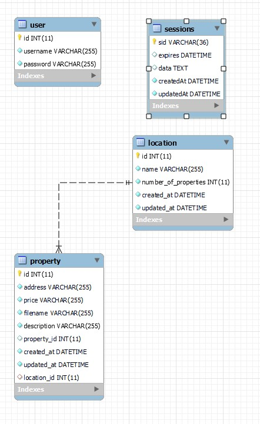
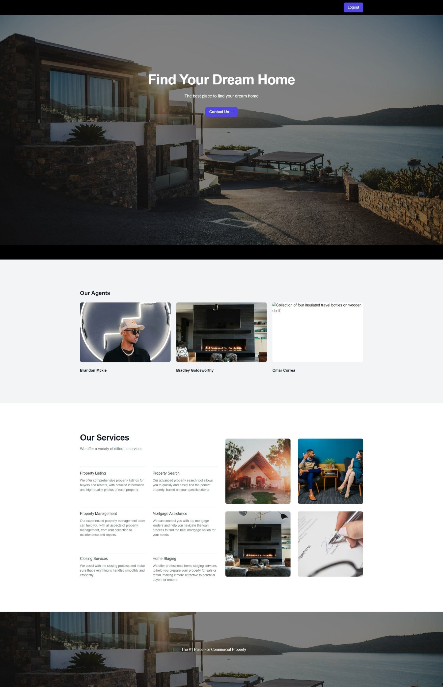

# Dream Home App Page

<p>
    
    
    
    
</p>

---

## Table of Contents
* [Description](#description)
* [Schema](#schema)
* [Visuals](#visuals)
* [License](#license)
* [Contributing](#contribution)
* [Questions](#contact-information)

---

## Description

This is a website tailored to individuals and families that are in the beginning steps of their home-buying process. The site allows users to browse through homes in and around the South Florida area once they have registered or logged into their online account. 

```
As a real estate search user
I WANT TO search a city in South Florida
SO THAT I can find current homes for sale
```

---
  
## Schema



## Visuals



---


---


---

## License
  [](https://opensource.org/licenses/MIT)

  * For more information on license types, please reference this website
  for additional licensing information - [https: //choosealicense.com/](https://choosealicense.com/).

---

## Contributing

  Not accepting contributions.

---

## Contact Information
  * GitHub Username: [BulkAcity](https://github.com/bulkacity)
  * GitHub Email: BG@bulkacity.com
  
